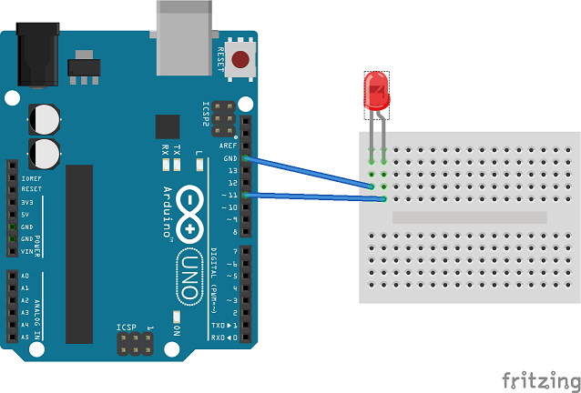

# PiArduinoJohnnyFive
Connecting and controlling an Arduino through a Raspberry Pi and the Johnny Five library

This repo will demonstrate how to setup a raspberry pi and control an Arduino on the same wireless network by hosting a local nodejs server using express js and serving a website to act as a controller for your device.

The end result will be an LED controlled by a web interface allowing us to switch the LED on and off.

Please note: for the Telstra Cloud Hackathon, all sd cards have been set up and preconfigured up to step 3 and have ssh and vnc enable on boot.


## What you will need:
- 1 x Raspberry Pi 3 (can use raspberry pi 2 with wireless adapter)
- 1 x Arduino (arduino nano used in this tutorial)
- 1 x Power pack / Powersource for the Raspberry Pi
- 1 x USB cable for the arduino
- A component of choice to control (We'll be using an LED)
- nodejs
- Firmata
- Wireless internet connection


## Steps
### 0. Prepairing your machine
This step will walkthrough the setup of node version manager nvm and install the latest stable version of nodejs.
If you have already installed nodejs and have npm, skip ahead to step 1.

First install NVM. NVM is a version manager for nodejs allowing you to have multiple versions of nodejs installed and easily switch between verions
To install NVM:

Mac/Linux: https://github.com/creationix/nvm#installation

Windows: https://github.com/coreybutler/nvm-windows


Now with nvm installed run the following command to install the latest version of nodejs
```
nvm install node
```

Once installed, you will need to tell nvm to use the latest version of nodejs
```
nvm use node
```


### 1. Flash the Arduino with Firmata
Install the Arduino desktop software on your PC/Mac from the link https://www.arduino.cc/en/Main/Software

Once the Arduino software's installed, install Interchange.
Interchange is tool that allows you to install custom firmatas on your Arduino device without using Arduino software or compiling firmware.
Install interchange globally using
```
npm install -g nodebots-interchange
```
Next, we're going to install the firmata software on the Arduino board, plug in your Arduino.

Firmata is a firmware that allows the arduino to relay information to and from it's components from a computer controlling the board.
It means we don't have to upload our code to Arduino every time we make a change.

```
interchange install --interactive
```
This will start an interactive prompt which allows us to select options with the arrow and enter keys.

The first question will be `Choose a firmware`, Select `StandardFirmata`


Then it will ask `Choose a board`, select which type of Arduino board you're using


Finally it will ask you what port to choose, this will look for the COM port that your Arduino device is connected on, select the COM port

Interchange will now pull in the correct firmware and flash your Arduino with Firmata.


### 2. Install Raspbian on the Raspberry Pi

Download and install the SDFormatter from https://www.sdcard.org/downloads/formatter_4/

Download the Raspbian image from https://www.raspberrypi.org/downloads/raspbian/, make sure to select the option with PIXEL

Plug in your SD card to your computer, then select open SDFormatter and format the card, a quick format will do.

Next, flash the image file onto your computer using the software listed below:

Mac: http://www.tweaking4all.com/hardware/raspberry-pi/macosx-apple-pi-baker/
Windows: https://sourceforge.net/projects/win32diskimager/

Remove the SDCard from your computer and insert in into your Raspberry Pi.
Start up your Pi and complete the setup. Once you've landed on the desktop, open a terminal by clicking on the black terminal square icon at the top

Then run the following commands
```
sudo apt-get update -y && sudo apt-get upgrade -y
```
Grab a coffee and come back, this command could take some time to run.
This will make sure all the software packages on your operating system are up to date.


### 3. Configure Raspbian
In a terminal run the following command:
``` 
sudo raspiconfig
```
This will open the Raspberry Pi configuration tool.

We want to change the device to allow ssh and vnc access.

We also want to change the hostname to something we can remember but also so it doesn't conflict with any other hostnames on the network, the default is raspberrypi.local

Now connect to the wireless network by selecting the network icon to the top right corner of the screen

Alternatively, you could click on the raspberry image in the top left corner > Preferences > raspberry pi configuration for a GUI that has the same options

### 4. Set up the hardware

Connect your led to the Arduino as show below



### 5. Setup the project on your PC

To test that the application actually works, connect the Arduino to your PC

Now clone this repo to your computer, if you know how to fork, that would be better
```
git clone https://github.com/constructnow/PiArduinoJohnnyFive.git && cd PiArduinoJohnnyFive 
```

Install all the dependencies
```
npm install
```


Now run the test application
```
node index.js
```

Wait until you receive the "Board is ready" message the open a web browser and type
```
http://localhost:3030
```

You should see two buttons "Turn on" and "Turn off" and a slider, test them all out and see if you can controll the LED


### 6. Setup the project on your Raspberry Pi

Now this is working lets get the raspberry pi doing all the lifting to allow you to control it from other devices

On your Raspberry Pi, open the terminal, then navigate to the desktop and clone the repo

```
cd ~/Desktop && git clone https://github.com/constructnow/PiArduinoJohnnyFive.git && cd PiArduinoJohnnyFive
```

Now we need to install the latest version of node and npm as well as arduino. For convenience sake, I've prepared a setup script for you
```
bash ./setup/node_npm.should
```


**Important!** Close the terminal and open a new one, then navigate back to the project directory
```
cd ~/Desktop/PiArduinoJohnnyFive
```

Install the project dependencies
```
npm install
```

Plug in the Arduino then run the test application
```
node index.js
```

Wait until you receive the "Board is ready" message, then open a web browser and type
```
http://localhost:3030
```

Now from another computer on the network open a web browser and goto
```
http://(the hostname from step 3).local:3030
```

## Refernces
Johnny Five Javascript Robotics & IOT library - http://johnny-five.io/

Interchange - https://github.com/johnny-five-io/¡nodebots-interchange